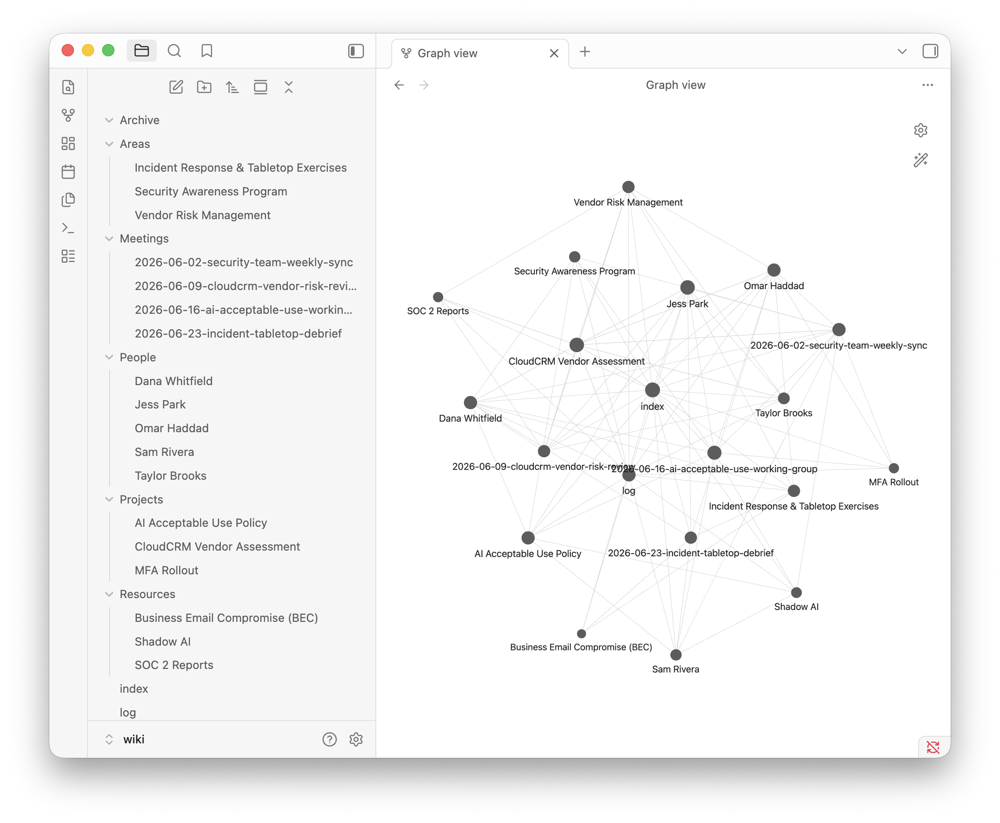

# Granola LLM Wiki – Demo



*This is where the walkthrough below ends: the demo wiki open in Obsidian's graph
view. Every meeting, person, and project is a page, and the cross-references are
already there.*

> **Demonstration repo with fictional data.** Every transcript, person, and company in
> here is invented (meet the security team at "Coastal Ridge Insurance"). The schema,
> tooling, and workflow are real – fork privately to use them with your own meetings.

A **second brain built from your meetings.** [Granola](https://www.granola.ai) records
and transcribes them; an LLM compiles the transcripts into a persistent, interlinked
wiki organized by PARA + People, and keeps it current. You curate and ask questions;
the LLM does all the bookkeeping. This repo is the working demo: three fictional
security-team meetings, fully ingested and fanned out, plus a fourth left for you to
ingest yourself.

**Obsidian is the IDE, the LLM is the programmer, `wiki/` is the codebase.**

## What this demonstrates

Two lessons in one artifact:

1. **Productivity – a curated second brain beats RAG.** Each meeting is ingested once
   and integrated into every page it touches: people, projects, areas, resources.
   Decisions are logged, contradictions are flagged with both dates, and answers come
   from pages that already reflect every meeting read so far. Nothing is re-derived
   per query. (The fictional meetings even contain a planted contradiction – see the
   guided tour.)
2. **Security – external key management as a control.** The Granola API key is a
   long-lived bearer secret for your entire meeting history. This repo treats it the
   way a GRC team would: resolved at runtime from **1Password CLI** (nothing on disk),
   Keychain as fallback, `.env` as last resort, monthly rotation, full policy in
   [SECURITY.md](SECURITY.md). Maps to NIST CSF 2.0 PR.AA-01.

Bonus: the fictional meetings are themselves security case studies – phishing metrics,
a SOC 2 vendor review, and a shadow-AI cleanup.

## What you'll need

- A Mac or Windows PC (Linux works too – follow the Mac steps) and ~15 minutes
- **No Granola account and no API key** – the demo runs entirely offline on the
  bundled fictional data
- Three free tools, installed as part of the walkthrough: [bun](https://bun.sh)
  (runs the fetch tool), [git](https://git-scm.com) (downloads this repo), and
  [Obsidian](https://obsidian.md) (browses the wiki)

Pick your platform and type each command exactly as shown, pressing Enter after each.

## Step by step – macOS

Open **Terminal** (Applications → Utilities → Terminal, or Spotlight-search
"Terminal").

**1. Install bun:**

```
curl -fsSL https://bun.sh/install | bash
```

Close that terminal, open a **new** one, and confirm the install:

```
bun --version
```

Any version number means success.

**2. Confirm git is installed:**

```
git --version
```

If macOS offers to install the Command Line Tools, accept, wait for it to finish,
then run `git --version` again.

**3. Download this repo and step into it:**

```
git clone https://github.com/CPAtoCybersecurity/granola-llm-wiki
cd granola-llm-wiki
```

**4. List the bundled demo meetings** (offline – nothing leaves your machine):

```
bun tools/granola-fetch.ts list --sample
```

**5. Fetch the exercise meeting**, copying the id printed by step 4:

```
bun tools/granola-fetch.ts fetch --sample demo-2026-06-23-tabletop-debrief
```

This writes a fourth transcript into `raw/transcripts/` – the one meeting nobody
has ingested into the wiki yet.

**6. Install Obsidian and open the wiki.** Download it from
[obsidian.md](https://obsidian.md) (or `brew install --cask obsidian` if you use
Homebrew). In Obsidian choose **Open folder as vault** and pick the `wiki` folder
*inside* `granola-llm-wiki`. Click the graph icon in the left sidebar – you're
looking at the picture at the top of this page. `[[Wikilinks]]` are clickable
here, not on GitHub's file viewer.

**7. (Optional) Run the LLM exercise.** Open your coding agent – Claude Code, or
any agent that reads `CLAUDE.md` – in the `granola-llm-wiki` folder and say:

> ingest the new transcript in raw/transcripts/ per CLAUDE.md

Watch it write the meeting page, update three people pages, touch two projects, and
log the operation. That fan-out is the whole idea. (Terminology: the tool's verb is
`fetch` – it pulls one transcript into `raw/`. "Ingest" means the full wiki
operation: fetch + the LLM fan-out.)

## Step by step – Windows

Same journey in **PowerShell** (Start menu → type "PowerShell" → Enter – not the
old Command Prompt; several commands below are PowerShell-only). Requires
Windows 10 version 1809 or later.

**1. Install bun** (this runs Bun's official installer):

```
irm bun.sh/install.ps1 | iex
```

Close that window, open a **new** PowerShell, and confirm the install:

```
bun --version
```

Any version number means success.

**2. Install git** (skip if `git --version` already answers):

```
winget install --id Git.Git -e
```

The first `winget` run may ask you to accept source agreements – press Y. If
`winget` itself isn't recognized (older Windows 10), install **App Installer**
from the Microsoft Store, or download git directly from
[git-scm.com](https://git-scm.com/download/win). Then close and reopen PowerShell
so git lands on your PATH, and check `git --version`.

**3. Download this repo and step into it:**

```
git clone https://github.com/CPAtoCybersecurity/granola-llm-wiki
cd granola-llm-wiki
```

**4. List the bundled demo meetings** (offline – nothing leaves your machine):

```
bun tools/granola-fetch.ts list --sample
```

**5. Fetch the exercise meeting**, copying the id printed by step 4:

```
bun tools/granola-fetch.ts fetch --sample demo-2026-06-23-tabletop-debrief
```

This writes a fourth transcript into `raw\transcripts\` – the one meeting nobody
has ingested into the wiki yet.

**6. Install Obsidian and open the wiki:**

```
winget install --id Obsidian.Obsidian -e
```

(or download from [obsidian.md](https://obsidian.md)). In Obsidian choose
**Open folder as vault** and pick the `wiki` folder *inside* `granola-llm-wiki`.
Click the graph icon in the left sidebar – you're looking at the picture at the
top of this page. `[[Wikilinks]]` are clickable here, not on GitHub's file viewer.

**7. (Optional) Run the LLM exercise.** Open your coding agent – Claude Code, or
any agent that reads `CLAUDE.md` – in the `granola-llm-wiki` folder and say:

> ingest the new transcript in raw/transcripts/ per CLAUDE.md

Watch it write the meeting page, update three people pages, touch two projects, and
log the operation. That fan-out is the whole idea. (Terminology: the tool's verb is
`fetch` – it pulls one transcript into `raw/`. "Ingest" means the full wiki
operation: fetch + the LLM fan-out.)

## Guided tour (3 stops, ~5 minutes)

1. **[`wiki/index.md`](wiki/index.md)** – the catalog. Three meetings in, this is the
   retrieval layer: no embeddings, no vector store, just an index an LLM reads first.
2. **[`wiki/Projects/MFA Rollout.md`](wiki/Projects/MFA%20Rollout.md)** – scroll to
   **Contradictions / updates**. The June 2 meeting said "end of June"; the June 16
   meeting said "mid-July". The wiki kept both, with citations. That evolution is
   exactly what RAG loses and a maintained wiki keeps.
3. **[`wiki/People/Sam Rivera.md`](wiki/People/Sam%20Rivera.md)** – one intern's page,
   compiled across meetings: assignments, delivery, open threads. Ask "what is Sam
   working on?" and this page *is* the answer.

## Troubleshooting

None of these are bugs – they're the four ways a fresh setup usually trips:

- **`bun: command not found`** (Windows: **`bun : The term 'bun' is not
  recognized`**) – the installer added bun to your PATH, but your current terminal
  hasn't picked it up. Open a new terminal (on macOS, `source ~/.zshrc` also works)
  and check `bun --version`. Still not found? Re-run the install command from step 1,
  then open a new terminal.
- **`Module not found "tools/granola-fetch.ts"`** – you're in the wrong directory. Run
  `pwd` (works in PowerShell too) and confirm you're in the folder that contains
  `tools/` and `wiki/`. A classic cause: cloning into a folder already named
  `granola-llm-wiki`, which nests the repo one level down
  (`granola-llm-wiki/granola-llm-wiki`) – `cd` into the inner one.
- **`usage: fetch --sample <id>`** – `fetch` needs a meeting id. Run
  `bun tools/granola-fetch.ts list --sample` first and copy the id it prints
  (`demo-2026-06-23-tabletop-debrief`) into the fetch command.
- **`self signed certificate in certificate chain`** (or any certificate error,
  usually on a work network) – your network inspects TLS: it re-signs HTTPS with
  your organization's root certificate, which bun doesn't trust by default even
  though your browser does. Trust the root instead of weakening TLS: run
  `bun --use-system-ca tools/granola-fetch.ts check` (uses the OS trust store,
  where IT installed the root) or set `NODE_EXTRA_CA_CERTS=/path/to/corp-root.pem`.
  On a home network, take the error at face value instead – the certificate may
  genuinely be bad. Never set `NODE_TLS_REJECT_UNAUTHORIZED=0` – that disables
  verification for everything. More in [SECURITY.md](SECURITY.md).

## Using your real Granola account

Do this in a **private fork** – real transcripts and People pages are sensitive.

Generate the API key in the Granola desktop app, then store it in a key manager.
One rule applies to every option: paste the key **into the manager's app or web
vault**, never into a terminal command – anything in argv is visible to `ps` and
lands in shell history. In order of preference:

### Option 1 – 1Password CLI (native, preferred)

The tool reads `op://Private/Granola/credential` automatically (override via
`GRANOLA_OP_REF`).

```
# one-time: install the CLI and wire it to the desktop app
brew install 1password-cli                       # macOS
winget install --id AgileBits.1Password.CLI -e   # Windows
# 1Password app → Settings → Developer → turn on "Integrate with 1Password CLI"
#   (optionally enable Touch ID / Windows Hello there too)
op whoami        # confirms sign-in – prompts via the app if needed

# store: in the 1Password app, create an item "Granola" in vault "Private"
# with a field named "credential", and paste the key into that field

# verify – the tool resolves the key itself and never prints it
bun tools/granola-fetch.ts check
```

Don't "test" with a bare `op read op://Private/Granola/credential` – that prints
the key into your terminal and scrollback.

### Option 2 – Bitwarden CLI (any platform, incl. self-hosted)

The tool has no native Bitwarden reader – you inject the key per-invocation
through its `GRANOLA_API_KEY` environment slot. Nothing lands on disk.

```
# one-time: install and sign in
brew install bitwarden-cli                   # macOS
bun install -g @bitwarden/cli                # any platform (incl. Windows)
bw config server https://vault.example.com   # self-hosted only – skip for bitwarden.com
bw login                                     # email + master password (+ 2FA)

# store: in the Bitwarden app or web vault, create a Login item named
# "Granola" and paste the key into its password field

# each session (macOS/Linux): unlock, run, lock
export BW_SESSION="$(bw unlock --raw)"
GRANOLA_API_KEY="$(bw get password Granola)" bun tools/granola-fetch.ts check
bw lock
```

On Windows, PowerShell has no per-command environment prefix, so set the variable,
run the tool, then remove it:

```powershell
$env:BW_SESSION = bw unlock --raw
$env:GRANOLA_API_KEY = bw get password Granola
bun tools/granola-fetch.ts check
Remove-Item Env:GRANOLA_API_KEY
bw lock
```

Optional convenience for your `~/.zshrc` (macOS/Linux). The single quotes are
load-bearing: they defer the lookup, so the key is resolved fresh on every call and
never touches disk. With double quotes the lookup would run once at shell startup
and bake the key into your environment:

```
alias granola='GRANOLA_API_KEY="$(bw get password Granola)" bun tools/granola-fetch.ts'
```

### Option 3 – macOS Keychain (macOS only, local fallback)

```
security add-generic-password -a "$USER" -s granola-api-key -w
```

(`-w` with no value prompts for the secret – paste at the hidden prompt.)

### Option 4 – `.env` (last resort)

Gitignored but plaintext on disk – see `.env.example`. Prefer any option above.

Whichever store you use: verify with `bun tools/granola-fetch.ts check`, then
`list` and `fetch <note_id>` (several ids at once, or `fetch --since YYYY-MM-DD`
to pull a backlog). Rotate the key monthly; [SECURITY.md](SECURITY.md) explains
why and how.

## Layout

- `raw/transcripts/` – immutable transcript drops (source of truth; never edited)
- `samples/` – bundled fictional meetings for the offline exercise
- `wiki/` – the wiki (Obsidian vault): `Meetings/` → `Projects/ Areas/ Resources/ Archive/ People/`
- `wiki/index.md` – catalog · `wiki/log.md` – operation timeline
- `tools/granola-fetch.ts` – secure fetch (1Password CLI → Keychain → .env) + sample mode
- `docs/` – README images
- `CLAUDE.md` – **the schema the LLM follows every session** (start there)
- `SECURITY.md` – key management policy, rotation, leak runbook

## Credits

This project stands on two sources, credited for different things:

- **Concept:** Andrej Karpathy's ["LLM Wiki"](https://gist.github.com/karpathy/442a6bf555914893e9891c11519de94f)
  (April 2026) – the idea that an LLM should build and *maintain* a persistent,
  interlinked knowledge base rather than re-retrieve raw documents per query. In his
  words: "The wiki is a persistent, compounding artifact. The cross-references are
  already there." and "You never (or rarely) write the wiki yourself—the LLM writes
  and maintains all of it."
- **Walkthrough reference:** ["I Turned Claude Into the Ultimate Second Brain"](https://www.youtube.com/watch?v=8QQ_INxAhRs)
  by Nate Herk (AI Automation) – a practical build of the same pattern.
- Also: [Granola](https://www.granola.ai) for the meeting transcription layer, and
  Tiago Forte's [PARA method](https://fortelabs.com/blog/para/) for the organizing
  scheme.

## License

MIT – see [LICENSE](LICENSE).
