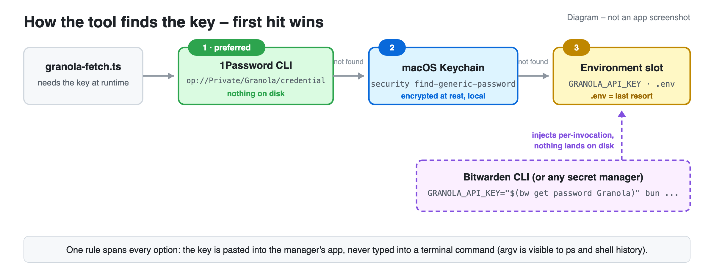
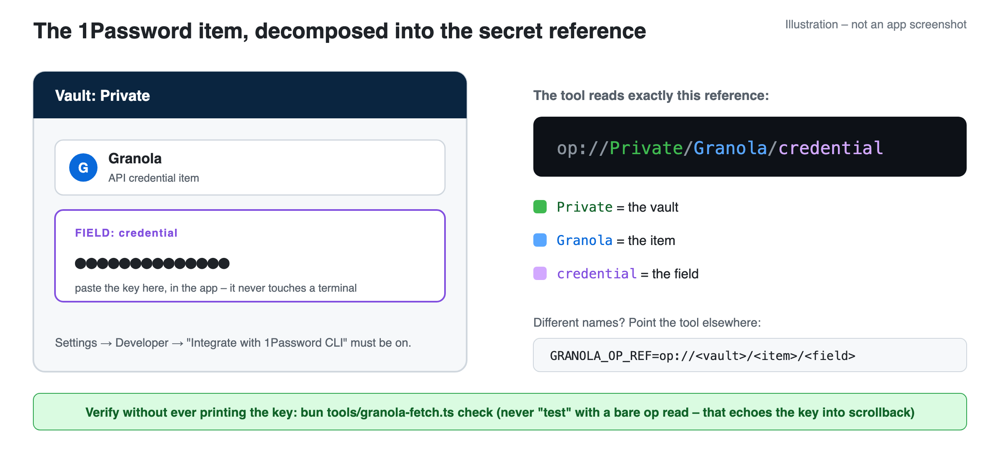
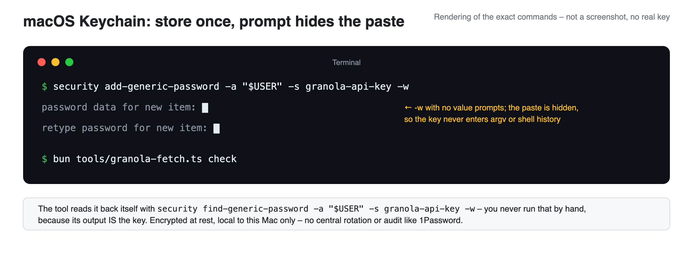
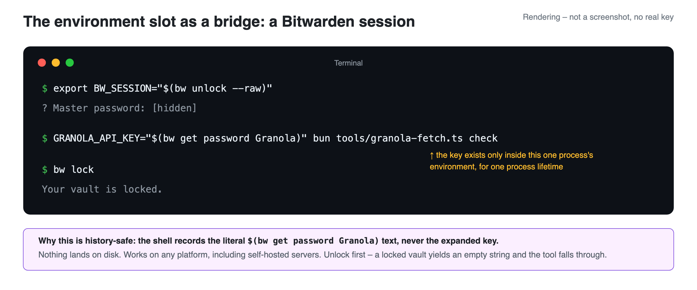

# Security – Key Management as a Teachable Control

This repo doubles as a small security lesson. The Granola API key is a **long-lived
bearer secret**: anyone holding the string has full access to your entire meeting
history. That makes it a good case study in credential lifecycle management:
**NIST CSF 2.0 PR.AA-01** ("Identities and credentials for authorized users,
services, and hardware are managed by the organization").

## The problem with personal access tokens and API keys

A raw PAT or API key sitting in a `.env` file has five problems:

1. **Long-lived.** It works today, next month, and next year – every day it exists
   is another chance for it to leak.
2. **Bearer auth.** Possession equals identity. No second factor, no device binding.
3. **Plaintext at rest.** `.env` files end up in backups, disk images, and the
   occasional accidental commit.
4. **Leaky by habit.** Keys passed as command-line arguments show up in shell
   history and `ps` output. Keys pasted into chat windows are cached who-knows-where.
5. **No lifecycle.** Nothing expires it, nothing audits it, and revoking it means
   remembering every place you put it.

The *ideal* fix is short-lived, scoped, auto-expiring credentials. When a vendor
only issues long-lived keys (most do, Granola included), you compensate with the
controls below.

## The control: external key management

This tool reads the key at runtime from an external key manager and never stores
it in the repo. Resolution order:

| Priority | Store | Why |
|----------|-------|-----|
| 1 | **[1Password CLI](https://developer.1password.com/docs/cli/get-started/)** (`op read op://Private/Granola/credential` – [secret reference syntax](https://developer.1password.com/docs/cli/secret-references/)) · [setup](#1password-setup) | Nothing on disk. Central rotation, revocation, and audit. Same reference works on every machine. |
| 2 | **[macOS Keychain](https://support.apple.com/guide/keychain-access/welcome/mac)** (`security find-generic-password`) · [setup](#macos-keychain-setup) | Encrypted at rest, local to the machine. Good fallback without a 1Password account. |
| 3 | **Environment / [`.env`](.env.example)** | Last resort as a *store* (plaintext on disk) – but the environment slot is also the **bridge for other key managers** like the [Bitwarden CLI](https://bitwarden.com/help/cli/): anything that can resolve a secret can inject it per-invocation · [setup](#bitwarden-setup) |



One rule spans every option: the key is pasted **into the manager's app or web
vault**, never typed into a terminal command. Anything in argv is visible to
`ps` while the command runs and lands in shell history forever.

### 1Password setup



```
# 1. Install the CLI and wire it to the desktop app (one time)
brew install 1password-cli
# 1Password app → Settings → Developer → turn on "Integrate with 1Password CLI"
#   (optionally enable Touch ID there for biometric approval of CLI reads)
op whoami        # confirms you're signed in – prompts via the app if not

# 2. Create the item IN THE APP: vault "Private", item "Granola", and a field
#    named "credential". Paste the key into that field – nothing touches disk,
#    nothing enters argv.

# 3. The tool reads it automatically; verify without ever printing the key:
bun tools/granola-fetch.ts check
```

Never run a bare `op read op://Private/Granola/credential` to "test" the setup –
that prints the key into your terminal and scrollback. Let the tool resolve it;
its `check` command confirms auth and shows nothing.

The secret reference is configurable: set `GRANOLA_OP_REF=op://<vault>/<item>/<field>`.
An alternative pattern for whole environments is `op run --env-file=.env.op -- <command>`,
which injects resolved secrets into a subprocess without ever writing them out.

### macOS Keychain setup

No 1Password account? The Mac's built-in Keychain
([Keychain Access guide](https://support.apple.com/guide/keychain-access/welcome/mac))
stores the key encrypted at rest, local to this machine:



```
security add-generic-password -a "$USER" -s granola-api-key -w
```

`-w` with no value prompts for the secret – paste at the hidden prompt, so the
key never enters argv or shell history. The tool reads it back itself (service
name configurable via `GRANOLA_KEYCHAIN_SERVICE`); verify with
`bun tools/granola-fetch.ts check`. What you give up versus 1Password: central
rotation, revocation, and audit – the key lives on this one machine.

### Bitwarden setup

The tool has no native Bitwarden reader – Bitwarden rides the chain's environment
slot (priority 3): the CLI resolves the key at runtime and injects it into the one
process that needs it. Nothing lands on disk, and it works on any platform,
including self-hosted servers.



```
# 1. Install and sign in (one time)
brew install bitwarden-cli
bw config server https://vault.example.com   # self-hosted only – skip for bitwarden.com
bw login                                     # email + master password (+ 2FA)

# 2. Create the item IN THE APP or web vault: a Login item named "Granola",
#    key pasted into its password field (same argv rule as above).

# 3. Each working session: unlock, run, lock.
export BW_SESSION="$(bw unlock --raw)"       # session token, this shell only
GRANOLA_API_KEY="$(bw get password Granola)" bun tools/granola-fetch.ts check
bw lock                                      # invalidates the session token
```

Session model: `bw login` happens once per machine; `bw unlock --raw` returns a
session token that the other commands read from `BW_SESSION`; `bw lock` (or
closing the shell) invalidates it. If more than one vault item matches "Granola",
`bw get` refuses and lists the candidate ids – rerun with
`bw get password <id>`. (Don't reach for `bw list items` to disambiguate: its
JSON output includes stored passwords.)

Why this pattern is history-safe: your shell records the literal
`$(bw get password Granola)` text, never the expanded key. Two honest caveats,
though. First, while the command runs, the injected key – and `BW_SESSION`, which
can decrypt the vault – sit in the process environment, readable by other
processes of the same user and by root (`ps -E` on macOS, `/proc/<pid>/environ`
on Linux). That exposure is inherent to bridging into an env slot and lasts one
process lifetime. Second, if the vault is locked, the substitution captures an
empty string (bw prints its errors to stderr, verified) and the tool silently
falls through to the next store in its chain – run the unlock step first.

## Rotation

Rotate long-lived keys **monthly**. Rotation is not the control – it's the
parameter. What rotation buys you is a bounded exposure window: if the key leaked
on day 3, it dies by day 31 whether you noticed or not. External key management is
what makes monthly rotation cheap enough to actually happen: generate a new key in
the Granola app, paste it into the 1Password or Bitwarden item, revoke the old one.
One field edit, every machine picks it up, nothing else changes.

Set a recurring reminder, or use 1Password's built-in item expiry notifications
(Bitwarden has no per-item expiry alerts – use an external reminder).

Mapping note: rotation is the lifecycle parameter of PR.AA-01; the same practice also
touches PR.AA-05 (least-privilege access) and PR.DS-01 (protecting data at rest), and
the rotation policy itself belongs to the governance function (GV).

## Corporate networks: TLS interception

On many corporate networks, a security gateway inspects HTTPS by re-signing it
with the organization's own root certificate – a deliberate, policy-sanctioned
man-in-the-middle. Your browser trusts it because IT installed that root in the
operating system's trust store; bun ships its own bundled CA store and doesn't
read the OS store by default, so the same request that works in a browser fails
in this tool with a certificate error.

The lesson mirrors the key-management one: **fix trust precisely, don't disable
it.** Two right answers, one wrong one:

```
bun --use-system-ca tools/granola-fetch.ts check           # use the OS trust store
NODE_EXTRA_CA_CERTS=/path/to/corp-root.pem bun tools/...   # or hand bun the root CA
```

Details that matter: `--use-system-ca` reads the platform trust store, so the
organization's root must already be installed there (on managed macOS/Windows it
is; on Linux, install it system-wide first, e.g. `update-ca-certificates`).
`NODE_EXTRA_CA_CERTS` takes one absolute path to a PEM file, read at process
start. And diagnose before trusting: a certificate error on a *non*-managed
network usually means the server's certificate really is expired, self-signed,
or wrong – adding trust is the fix for interception, not for a bad certificate.

The wrong answer – `NODE_TLS_REJECT_UNAUTHORIZED=0` – is the top search result
and turns off certificate verification for every connection the process makes.
That converts a scoped, audited interception into blind trust of anyone on the
path. Never ship it, never paste it into CI.

## If the key leaks

If you ever see the key in output, a commit, a log, or a chat window:

1. **Rotate immediately** in the Granola desktop app (generate new, revoke old).
2. Update the 1Password or Bitwarden item – every machine gets the new key on
   next run.
3. If it hit a git commit, treat the repo as burned: rotate first, then scrub.

## Hard rules this repo enforces

- The key never appears in argv (`ps`-visible), output (redacted), or any file.
- `.env` is gitignored; `.env.example` contains placeholders only.
- The bundled demo data is fictional, so this public repo contains no secrets and
  no personal data. **If you fork this for your real Granola account, make the
  fork private** – real transcripts and People pages are sensitive.

## Reporting

Found a security issue in this demo? Open a GitHub issue (no secrets in the
issue body, please).
